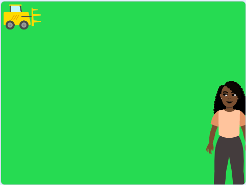

## Create a forest

Did you know that forests cover 30% of the Earth’s land surface? In this step you will add code to create a forest with a variety of different trees.

--- task ---

If working **online**, open the [starter project](http://rpf.io/p/en/projectName-on){:target="_blank"} in Scratch.

If working **offline**, open the project [starter file](http://rpf.io/p/en/projectName-get){:target="_blank"} in the Scratch offline editor. If you need to download and install Scratch, you can find it [here](https://scratch.mit.edu/download){:target="_blank"}.

You should see a green grassland background.



--- /task ---

Use a loop to plant 50 trees to start your forest.

--- task ---

Go to the Sprites pane and click on the **Tree** sprite. Drag a `when flag clicked`{:class="block3events"} block and `repeat 10`{:class="block3control"} block onto your Code area. For the `repeat 10`{:class="block3control"} block change the value `10` to `50`.

```blocks3
when flag clicked
repeat (50)
```

--- /task ---

Plant the new trees in random positions across the stage.

--- task ---

Use a `go to random position`{:class="block3motion"} block to vary where the trees grow. Then add a `create clone of myself`{:class="block3control"} block to create the forest.

```blocks3
when flag clicked
repeat (50)
+go to [random position v]
+create clone of [myself v]
end
```

--- /task ---

It’s important that we plant a variety of trees to house a range of animals.

The **Tree** sprite has 3 costumes (tree 1, tree 2 and tree 3). Use the `random`{:class="block3operators"} operator to vary the looks of the trees and add variety to your forest.

--- task ---

Start a new script with a `when I start as a clone`{:class="block3control"} block. Add a `switch costume to`{:class="block3looks"} block to the script. Then drag a `pick random`{:class="block3operators"}`1``to`{:class="block3operators"}`10` block into the `switch costume to`{:class="block3looks"} block. Change the values `1` and `10` to `1` and `3`.  

```blocks3
when I start as a clone
switch costume to (pick random (1) to (3))
```

--- /task ---

--- task ---

Test your project by clicking on the green flag. Make sure your forest has a variety of trees.

--- /task ---

Trees don't just appear fully-grown, they get bigger over time. Set up a repeat loop to change the size slowly creating an animated growth appearance.

--- task ---

To start small tell your cloned tree to `set size to `{:class="block3looks"}`100``%`{:class="block3looks"} but change the value to `0`. Next add a `repeat`{:class="block3control"}`10` block changing the value to `2`. Lastly the tree needs to pause after each size adjustment, add a `wait`{:class="block3control"} `1` `seconds`{:class="block3control"} block and change the value to `0.1` so that it changes quickly.  

```blocks3
when I start as a clone
switch costume to (pick random (1) to (3))
+ set size to (0)%
+ repeat (10)
+ change size by (2)
+ wait 0.1 seconds
+ end
```

--- /task ---

--- save ---
