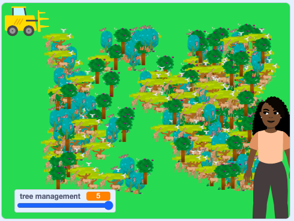

## Tree management

In the simulation we want to see the impact of new trees sprouting at a faster or slower speed. The speed at which new trees grow depends on a number of factors such as climate conditions, soil quality, disease, sunlight and water. In this step you'll add a slider to demonstrate how managing these conditions impacts the growth of the number of trees in the area. 

The growing speed will be held in a variable called `tree management`{:class="block3variables"}.

--- task ---

Create a new variable by clicking on the `Variables`{:class="block3variables"} blocks menu.

Then click on the **Make a Variable** button.

You can give your variable a name. Call this variable `tree management`.

--- /task ---

Your new variable is visible on the stage. Create a slider to control the speed in your simulation.

--- task ---

On the stage, right-click on the tree management variable, and a menu will appear.

Select **slider** in the menu.

--- /task ---

At the moment the tree management range is too wide.

--- task ---

On the stage, right-click on the tree managementh slider and select **change slider range**.

Change the range to between `0` and `5`.

--- /task ---

Currently the code is set to always wait 1 seconds but in our simulation the **tree management** slider will control the speed the trees grow. Moving the slider to the right will speed up the growth whilst moving to the left will slow down the growth. When the slider is at the right the simulation will wait 1 seconds to plant a tree and when it is at the left it will wait 6 seconds to plant a tree.

 

This means if `tree management`{:class="block3variables"} equals `4` the wait time will be 2 second but if `tree management`{:class="block3variables"} equals `1` the wait time will be slower at 5 seconds. 

Scratch has a `timer`{:class="block3sensing"} block you can use the the simulation so that the **tree management** slider smoothly controls the number of trees growing. Your program should reset the timer each time a new sprouting position is chosen then repeat until the timer is greater than the sum of 6 - the value in the tree management slider.

--- task ---

Insert a `repeat until`{:class="block3control"} block in your `when flag clicked`{:class="block3events"} script wrapping it round the existing `wait 1 seconds`{:class="block3control"} and `create clone of myself`{:class="block3control"} blocks. Above your new `repeat until` block and a `reset timer`{:class="block3sensing"}.

```blocks3
when flag clicked
hide
forever
go to x:(pick random (-150) to (200)) y:(pick random (-120) to (120))
+ reset timer
+ repeat until ()
wait (1) seconds
create clone of [myself v]
end
```
--- /task ---

--- task ---

Add a greater than block into your `repeat until`{:class="block3control"} block and build the condition `timer`{:class="block3sensing"}`>`{:class="block3operators"}`6``-`{:class="block3operators"}`tree management`{:class="block3variables"}:

```blocks3
when flag clicked
hide
forever
go to x:(pick random (-150) to (200)) y:(pick random (-120) to (120))
+ reset timer
+ repeat until ()
wait (1) seconds
create clone of [myself v]
end
```
--- /task ---

--- task ---

Go to the `Sensing`{:class="block3sensing"} menu. 


```blocks3
when flag clicked
repeat (50)
go to [random position v]
create clone of [myself v]
end
forever
go to [random position v]
+ wait ((5)-(forest health)) seconds
create clone of [myself v]
end
```

--- /task ---

--- task ---

Test your simulation again. The **forest health** slider will control the speed the forest grows.



--- /task ---
