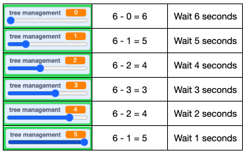

## Tree management

In the simulation we want to see the impact of trees growing at a faster or slower speed. The speed at which a forest grows depends on a number of factors such as climate conditions, soil quality, disease, sunlight and water. In this step you'll add a slider to demonstrate the impact of forest health conditions on forest growth.

The growing speed will be held in a variable called `forest health`{:class="block3variables"}.

--- task ---

Create a new variable by clicking on the `Variables`{:class="block3variables"} blocks menu.

Then click on the **Make a Variable** button.

You can give your variable a name. Call this variable `forest health`.

--- /task ---

Your new variable is visible on the stage. Create a slider to control the speed in your simulation.

--- task ---

On the stage, right-click on the forest health variable, and a menu will appear.

Select **slider** in the menu.

--- /task ---

At the moment the forest health range is too wide.

--- task ---

On the stage, right-click on the forest health slider and select **change slider range**.

Change the range to between `0` and `5`.

--- /task ---

Use a loop so that trees are continuously being planted in random positions.

--- task ---

Add a `forever`{:class="block3control"} block to the end of the `when flag clicked`{:class="block3events"} script for the **Tree**  sprite. Within the `forever`{:class="block3control"} loop add a `go to random position`{:class="block3motion"} block. Next add a `wait 1 seconds`{:class="block3control"} block and a `create a clone of myself`{:class="block3control"} block to complete the loop:


```blocks3
when flag clicked
repeat (50)
go to [random position v]
create clone of [myself v]
end
+ forever
go to [random position v]
wait (1) seconds
create clone of [myself v]
end
```

--- /task ---

 Currently the code is set to always wait 1 seconds but in our simulation the **forest health** slider will control the speed the trees grow. Moving the slider to the right will speed up the growth whilst moving to the left will slow down the growth. When the slider is at the right the simulation will wait 0 seconds to plant a tree and when it is at the left it will wait 5 seconds to plant a tree.

 

 This means if `forest health`{:class="block3variables"} equals `4` the wait time will be 1 second but if `forest health`{:class="block3variables"} equals `2` the wait time will be slower at 3 seconds.

--- task ---

Go to the `Operator`{:class="block3operators"} menu and add a `-`{:class="block3operators"} block entering the value `5` and dragging a `forest health`{:class="block3variables"} into the operator:


```blocks3
when flag clicked
repeat (50)
go to [random position v]
create clone of [myself v]
end
forever
go to [random position v]
+ wait ((5)-(forest health)) seconds
create clone of [myself v]
end
```

--- /task ---

--- task ---

Test your simulation again. The **forest health** slider will control the speed the forest grows.


--- /task ---
